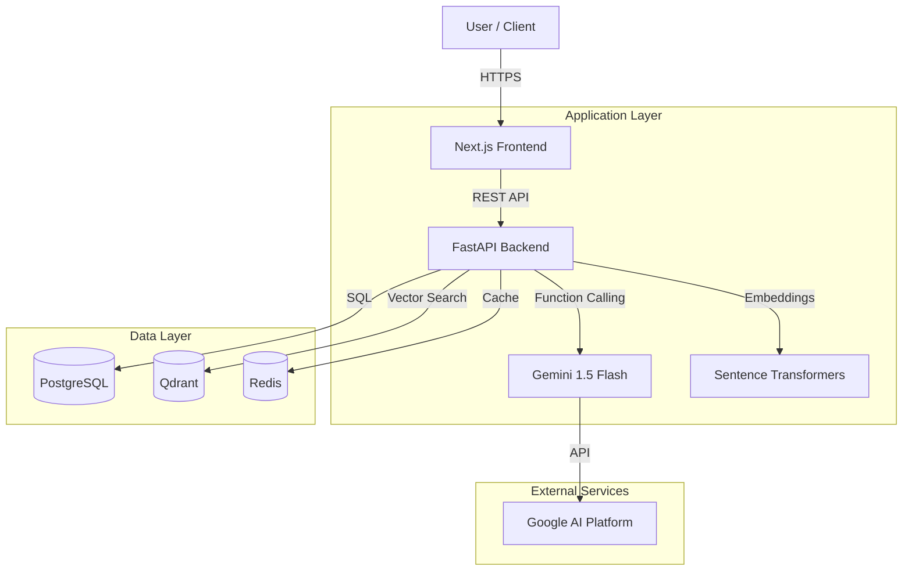

# System Architecture

## 1. High-Level Overview

gstGPT employs a modern **Microservices Architecture** designed for scalability, maintainability, and separation of concerns. The system is composed of three primary layers:

1.  **Presentation Layer (Frontend)**: A responsive web application built with Next.js.
2.  **Application Layer (Backend)**: An async Python API built with FastAPI, handling business logic, AI orchestration, and database interactions.
3.  **Data Layer**: Persistent storage using PostgreSQL (relational) and Qdrant (vector).

---

## 2. Component Diagram

---

## 3. Data Flow

### 3.1. RAG (Retrieval-Augmented Generation) Flow
When a user asks a general question (e.g., "What is the GST rate for gold?"):

1.  **Ingestion**: GST Acts/Rules are chunked and embedded into `Qdrant`.
2.  **Query**: User sends a question.
3.  **Retrieval**: Backend converts query to vector -> Searches `Qdrant` for top-k relevant chunks.
4.  **Generation**: Backend constructs a prompt with Context + Query -> Sends to `Gemini`.
5.  **Response**: Gemini generates an answer based *only* on the provided context.

### 3.2. Agentic Workflow (Tool Execution)
When a user asks for data or action (e.g., "Draft GSTR-1"):

1.  **Intent Recognition**: `Gemini` analyzes the prompt and decides to call a tool (e.g., `draft_gstr1`).
2.  **Tool Execution**: 
    - The LLM returns a function call.
    - The Backend executes the Python function `agent_tools.draft_gstr1()`.
    - The function interacts with `PostgreSQL` to create a `ReturnFiling` record.
3.  **Context Capture**: The tool result (JSON) is captured via `ContextVar`.
4.  **Response Construction**: 
    - The Backend sends the tool result back to the LLM for a natural language summary.
    - The Backend *also* attaches the structured tool result (`tool_context`) to the API response.
5.  **UI Rendering**: The Frontend detects `tool_context` and renders the appropriate Widget (e.g., `ReturnDraftCard`).

---

## 4. Database Schema

### 4.1. Relational (PostgreSQL)

**`invoices` Table**
- `id`: PK
- `gstin`: String (Indexed)
- `total_amount`: Decimal
- `items`: JSONB (Line items)

**`return_filings` Table**
- `id`: PK
- `period`: String (e.g., "October 2023")
- `status`: Enum (DRAFT, FILED)
- `return_type`: Enum (GSTR1, GSTR3B)

### 4.2. Vector (Qdrant)

**`gst_rules` Collection**
- `vector`: 384-dim float array (MiniLM-L6-v2)
- `payload`: { "text": "...", "source": "CGST Act Section 9" }

---

## 5. Security Considerations

- **API Security**: All endpoints are protected via CORS policies (configurable). Future: JWT Authentication.
- **Environment Variables**: Sensitive keys (API Keys, DB Credentials) are managed via `.env` files and never committed to code.
- **Data Isolation**: Multi-tenancy is supported at the database level (future scope) by filtering queries by `org_id`.

---

## 6. Scalability & Performance

To ensure gstGPT can handle enterprise-scale loads (e.g., millions of invoices), the architecture is designed for horizontal scalability at every layer.

### 6.1. Scalability Architecture Diagram

### 6.2. Scaling Strategies

#### **Frontend & Backend (Stateless)**
- **Horizontal Scaling**: The Next.js frontend and FastAPI backend are stateless containerized applications. They can be scaled horizontally using **Kubernetes (K8s)** or **Docker Swarm**.
- **Load Balancing**: An Application Load Balancer (ALB) or Nginx distributes incoming traffic across healthy instances.

#### **Database (Stateful)**
- **Read Replicas**: To handle high read traffic (e.g., dashboard analytics), we employ **PostgreSQL Read Replicas**. The application directs write operations to the Primary DB and read operations to Replicas.
- **Connection Pooling**: `PgBouncer` is used to manage and reuse database connections efficiently, preventing connection exhaustion under load.

#### **Vector Search**
- **Distributed Qdrant**: Qdrant supports distributed deployment with sharding. As the Knowledge Base grows, we can shard the collection across multiple nodes to maintain low-latency search.

#### **Async Processing (Worker Nodes)**
- **Message Queue**: Long-running tasks (e.g., "Draft GSTR-1 for 10,000 invoices") are offloaded to a **RabbitMQ** or **Redis** queue.
- **Celery Workers**: Dedicated worker nodes consume these tasks asynchronously, ensuring the API remains responsive.

### 6.3. Caching Strategy
- **API Response Cache**: Redis caches common API responses (e.g., "Get Tax Rates") to reduce DB load.
- **Semantic Cache**: We cache LLM responses for identical or semantically similar queries to save on API costs and latency.

---

## 7. Visual Architecture Reference

